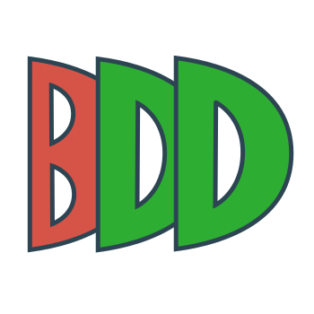

<div align="center">
  <a href="https://vitalets.github.io/playwright-bdd">
    
  </a>
</div>

<h2 align="center">Playwright-BDD</h2>
<div align="center">

Run BDD tests with Playwright runner

</div>

<div align="center">

[](https://github.com/vitalets/playwright-bdd/actions/workflows/lint.yaml)
[](https://github.com/vitalets/playwright-bdd/actions/workflows/test.yaml)
[](https://www.npmjs.com/package/playwright-bdd)
[](https://www.npmjs.com/package/playwright-bdd)


</div>

<p align="center">
  <a href="https://vitalets.github.io/playwright-bdd/">Documentation</a> |
  <a href="https://github.com/vitalets/playwright-bdd-example">Example</a> |
  <a href="https://github.com/vitalets/playwright-bdd/blob/main/CHANGELOG.md">Changelog</a>
</p>

> [!TIP]
> [BDD + MCP: Your thoughts?](https://github.com/vitalets/playwright-bdd/issues/321)

## Why BDD?
In the era of AI, you can take [BDD](https://cucumber.io/docs/bdd/) approach to the next level:

- 🤖 **Generate** feature files from raw business requirements using AI.
- ✅ **Refine** scenarios with colleagues or AI in plain human language.
- 🛠 **Automate** test execution using the Playwright runner.

## Why Playwright Runner?

Both [Playwright](https://playwright.dev/) and [CucumberJS](https://github.com/cucumber/cucumber-js) have their own test runners. You can use the CucumberJS runner with [Playwright as a library](https://playwright.dev/docs/library) to execute BDD scenarios. This package offers **an alternative**: convert BDD scenarios into test files and run them directly with Playwright. You gain all the advantages of the Playwright runner:

- Automatic browser initialization and cleanup
- Auto-capture of screenshots, videos, and traces
- Parallelization with sharding
- Auto-waiting for page elements
- Built-in visual comparison testing
- Power of Playwright fixtures
- [...and more](https://playwright.dev/docs/library#key-differences)

## How It Works


## Extras
Playwright-BDD has several unique features:

- 🔥 Advanced tagging [by path](https://vitalets.github.io/playwright-bdd/#/writing-features/tags-from-path) and [special tags](https://vitalets.github.io/playwright-bdd/#/writing-features/special-tags)
- 🎩 [Step decorators](https://vitalets.github.io/playwright-bdd/#/writing-steps/decorators) for class methods  
- 🎯 [Scoped step definitions](https://vitalets.github.io/playwright-bdd/#/writing-steps/scoped)  
- ✨ [Exporting steps](https://vitalets.github.io/playwright-bdd/#/writing-features/chatgpt) for AI  
- ♻️ [Re-usable step functions](https://vitalets.github.io/playwright-bdd/#/writing-steps/reusing-step-fn)  

## Documentation
Check out the [documentation website](https://vitalets.github.io/playwright-bdd/#/).

## Examples

- Check out [`examples`](/examples) folder
- Clone the fully working repo: [playwright-bdd-example](https://github.com/vitalets/playwright-bdd-example)

## Playwright Versions Support

`playwright-bdd` supports all **non-deprecated** versions of Playwright. To check which Playwright versions are currently deprecated, run:
```bash
npm show @playwright/test@1 deprecated
```

## Feedback & Community

Feel free to report a bug, propose a feature or share your experience:

* [GitHub issues](https://github.com/vitalets/playwright-bdd/issues)
* [Playwright-BDD Discord](https://discord.gg/5rwa7TAGUr)

## Changelog
Check out the latest changes in the [CHANGELOG.md](https://github.com/vitalets/playwright-bdd/blob/main/CHANGELOG.md).

## Contributing
Your contributions are welcome! Please review [CONTRIBUTING.md](https://github.com/vitalets/playwright-bdd/blob/main/.github/CONTRIBUTING.md) for the details.

## 💖 Sponsors

A big thank you to all the **amazing people and companies** already supporting Playwright-BDD! Your help keeps the project alive and growing:

<!-- sponsors --><a href="https://github.com/currents-dev"></a><a href="https://github.com/jzaratei"></a><a href="https://github.com/alescinskis"></a><a href="https://github.com/alexhvastovich"></a><a href="https://github.com/FrancescoBorzi"></a><!-- sponsors -->

If you find Playwright-BDD useful in your personal or work projects, consider [becoming a sponsor](https://github.com/sponsors/vitalets). Even small contributions help me dedicate more time to maintenance, new features, and community support.

## How to make BDD valuable for my project?

Have a look on [this section](https://vitalets.github.io/playwright-bdd/#/faq?id=how-to-make-bdd-valuable-for-my-project).

## My other Playwright tools

* [@global-cache/playwright](https://github.com/vitalets/global-cache) - Key-value cache for sharing data between parallel workers.
* [request-mocking-protocol](https://github.com/vitalets/request-mocking-protocol) - Mock server-side API calls in Playwright.
* [playwright-network-cache](https://github.com/vitalets/playwright-network-cache) - Speed up Playwright tests by caching network requests on the filesystem.
* [playwright-magic-steps](https://github.com/vitalets/playwright-magic-steps) - Auto-transform JavaScript comments into Playwright steps.

## License
This project is licensed under the [MIT License](https://github.com/vitalets/playwright-bdd/blob/main/LICENSE), allowing you to use, modify, and share the code freely, even for commercial purposes. Enjoy building something amazing! 🎉
