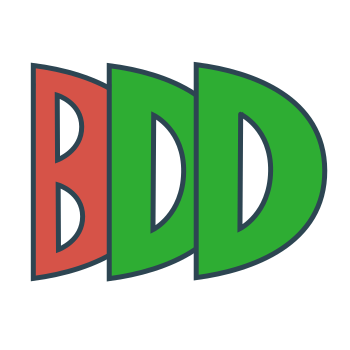

<div align="center">
  <a href="https://vitalets.github.io/playwright-bdd">
    
  </a>
</div>

<h2 align="center">Playwright-BDD</h2>
<div align="center">

Run BDD tests with Playwright runner

</div>

<div align="center">

[](https://github.com/vitalets/playwright-bdd/actions/workflows/lint.yaml)
[](https://github.com/vitalets/playwright-bdd/actions/workflows/test.yaml)
[](https://www.npmjs.com/package/playwright-bdd)
[](https://www.npmjs.com/package/playwright-bdd)
[](https://github.com/vitalets/playwright-bdd/blob/main/LICENSE)

</div>

<p align="center">
  🚀 <a href="https://vitalets.github.io/playwright-bdd/#/getting-started/index">Getting Started</a>&nbsp;
  📚 <a href="https://vitalets.github.io/playwright-bdd/">Documentation</a>&nbsp;
  ▶️ <a href="https://github.com/vitalets/playwright-bdd-example">Example</a>&nbsp;
  📝 <a href="https://github.com/vitalets/playwright-bdd/blob/main/CHANGELOG.md">Changelog</a>
</p>

## Why BDD in the Era of AI?

[Behavior-Driven Development (BDD)](https://cucumber.io/docs/bdd/) describes requirements through `Given / When / Then` steps, giving AI agents a clear, executable target. These steps are easy to read and refine during planning. They set practical constraints for generated code. They run as tests and stay aligned with the implementation over time, unlike plain markdown specs that tend to grow into walls of text.

Try the [playwright-bdd skill](https://vitalets.github.io/playwright-bdd/#/getting-started/agent-skill) to bring the agentic BDD workflow into your project.

## Why Playwright Runner?

Playwright can be used as a [browser automation library](https://playwright.dev/docs/library) with any test runner, such as CucumberJS or Vitest. However, it is most powerful when used with the **Playwright test runner**. Playwright-BDD converts BDD scenarios into native Playwright tests, so you get all Playwright runner features out of the box:

- Automatic browser setup and cleanup
- Auto-waiting for page elements
- Auto-capture of screenshots, videos, and traces
- Parallel execution and sharding
- Built-in reports and visual comparison testing
- Playwright fixtures
- [...and more](https://playwright.dev/docs/library#key-differences)

## How It Works


## Extras
Playwright-BDD has several unique features:

- 🔥 Advanced tagging [by path](https://vitalets.github.io/playwright-bdd/#/writing-features/tags-from-path) and [special tags](https://vitalets.github.io/playwright-bdd/#/writing-features/special-tags)
- 🎩 [Step decorators](https://vitalets.github.io/playwright-bdd/#/writing-steps/decorators) for class methods  
- 🎯 [Scoped step definitions](https://vitalets.github.io/playwright-bdd/#/writing-steps/scoped)  
- ✨ [Exporting steps](https://vitalets.github.io/playwright-bdd/#/writing-features/chatgpt) for AI  
- ♻️ [Re-usable step functions](https://vitalets.github.io/playwright-bdd/#/writing-steps/reusing-step-fn)  

## Documentation
Check out the [documentation website](https://vitalets.github.io/playwright-bdd/#/).

## Demos

- Check out [`examples`](/examples) folder
- Clone the fully working repo: [playwright-bdd-example](https://github.com/vitalets/playwright-bdd-example)

## Playwright Versions Support

`playwright-bdd` supports all **non-deprecated** versions of Playwright. To check which Playwright versions are currently deprecated, run:
```bash
npm show @playwright/test@1 deprecated
```

## Changelog
Check out the latest changes in the [CHANGELOG.md](https://github.com/vitalets/playwright-bdd/blob/main/CHANGELOG.md).

## 💖 Sponsors

Great thanks to the **amazing people and companies** already supporting Playwright-BDD! Your help keeps the project alive and growing:

<p align="center">
  <a href="https://currents.dev/" target="_blank">
    
  </a>
</p>

<p align="center">
<a href="https://www.testmuai.com/?utm_source=playwrightbdd&utm_medium=sponsor" target="_blank">
    <picture>
      <source media="(prefers-color-scheme: dark)" srcset="./docs/_media/sponsors/testmu-ai-white.svg" />
      <source media="(prefers-color-scheme: light)" srcset="./docs/_media/sponsors/testmu-ai-black.svg" />
      
    </picture>
  </a>
</p>

<p align="center">

<!-- sponsors --><a href="https://github.com/alescinskis"></a><a href="https://github.com/alexhvastovich"></a><a href="https://github.com/FrancescoBorzi"></a><!-- sponsors -->

</p>

If you find Playwright-BDD useful in your personal or work projects, consider [becoming a sponsor](https://github.com/sponsors/vitalets). Even small contributions help me dedicate more time to maintenance, new features, and community support.

## Feedback & Community

Feel free to report a bug, propose a feature or share your experience:

* [GitHub issues](https://github.com/vitalets/playwright-bdd/issues)
* [Playwright-BDD Discord](https://discord.gg/5rwa7TAGUr)

## Contributing
Your contributions are welcome! Please review [CONTRIBUTING.md](https://github.com/vitalets/playwright-bdd/blob/main/.github/CONTRIBUTING.md) for the details.

## Other Playwright tools

* [playwright-timeline-reporter](https://github.com/vitalets/playwright-timeline-reporter) - Interactive timeline report for Playwright test runs.
* [@global-cache/playwright](https://github.com/vitalets/global-cache) - Key-value cache for sharing data between parallel workers.
* [request-mocking-protocol](https://github.com/vitalets/request-mocking-protocol) - Mock server-side API calls in Playwright.
* [playwright-network-cache](https://github.com/vitalets/playwright-network-cache) - Speed up Playwright tests by caching network requests on the filesystem.
* [playwright-magic-steps](https://github.com/vitalets/playwright-magic-steps) - Auto-transform JavaScript comments into Playwright steps.

## License
This project is licensed under the [MIT License](https://github.com/vitalets/playwright-bdd/blob/main/LICENSE), allowing you to use, modify, and share the code freely, even for commercial purposes. Enjoy building something amazing! 🎉
