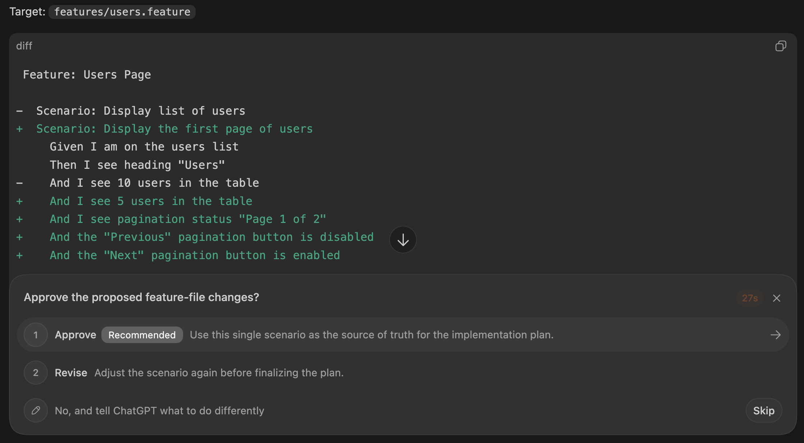
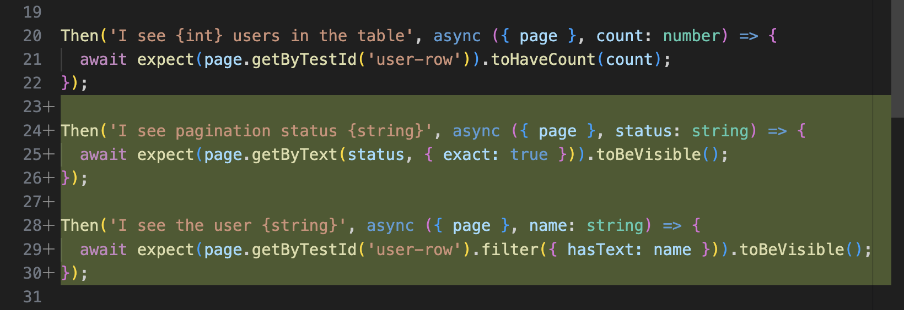

# Agent Skill

?> Agent Skill is a new feature. Your feedback and suggestions are [welcome](https://github.com/vitalets/playwright-bdd/issues).

Playwright-BDD provides an [agent skill](https://agentskills.io/) that helps AI coding agents generate Gherkin feature files and step definitions, grounded in your actual project steps.

## Supported agents

The skill works with GitHub Copilot, Claude Code, Cursor, Cline, Windsurf, and [many others](https://skills.sh/).

## Installation

Run the following command in your project:

```
npx skills add vitalets/playwright-bdd
```

## Usage

Once the skill installed, BDD will be automatically triggered when you start a new feature:

### Planning
Drafts BDD scenarios and asks for your approval. You can iterate on them to clarify the expected outcome before any code is written. Here's an example with **Codex**:



### Implementation
Builds the feature and wires up step definitions that match your existing code style:



### Verification
Automatically runs the generated BDD tests to verify the implementation and provide the report:


?> Check out the blog post [Why I Prefer BDD over SDD for Agentic Development](https://dev.to/vitalets/why-i-prefer-bdd-over-sdd-for-agentic-development-4c3d).