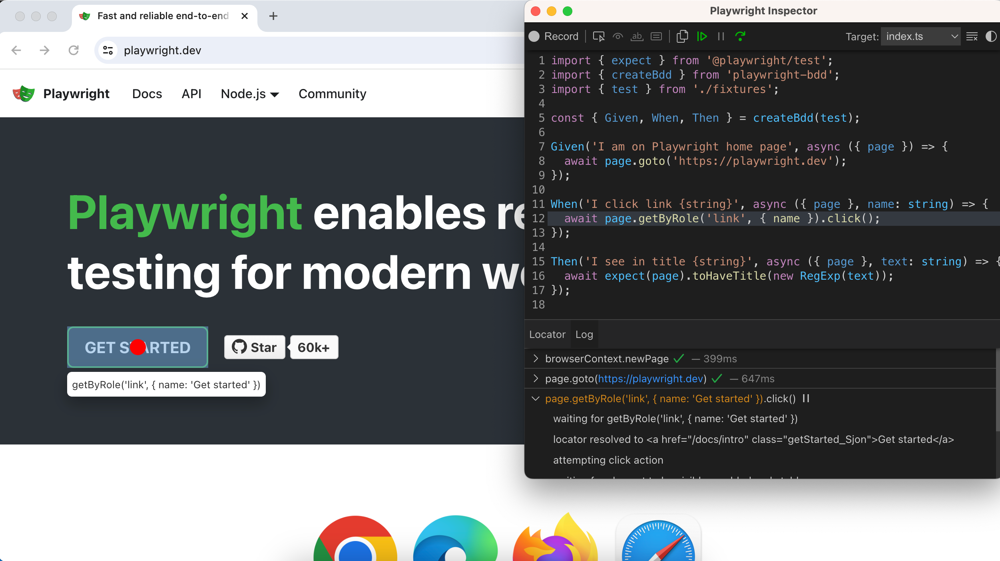

# Debugging

Playwright-bdd outputs regular Playwright test files. You can use any of [Playwright debugging methods](https://playwright.dev/docs/debug) for BDD tests.

#### Run tests with `--debug` flag
This command opens browser and allows step-by-step evaluation:
```
npx bddgen && npx playwright test --debug
```

Example screenshot:



#### Run tests with `--ui` flag
This command runs BDD tests in UI mode:
```
npx bddgen && npx playwright test --ui
```

> For UI mode details see also [watch mode](guides/watch-mode.md)