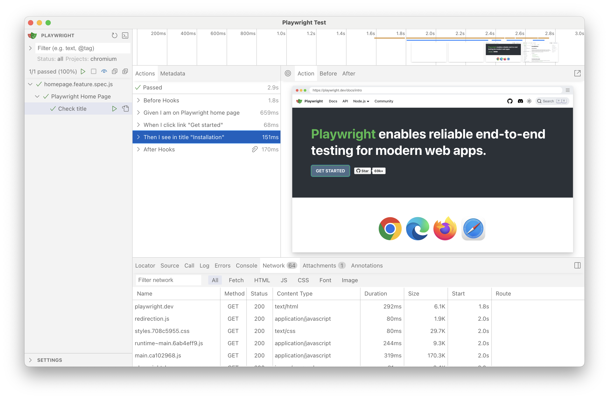

# UI Mode & Watching

You can automatically regenerate test files on any change in features or step definitions. Use [nodemon](https://github.com/remy/nodemon) to watch directories and call `npx bddgen`:
```
npx nodemon -w ./features -w ./steps -e feature,js,ts --exec "npx bddgen"
```

To debug tests in [UI Mode](https://playwright.dev/docs/test-ui-mode), run the above command together with `npx playwright test --ui`. You can utilize [npm-run-all](https://github.com/mysticatea/npm-run-all) package for that. Example `package.json`:

```json
"scripts": {
  "watch:bdd": "nodemon -w ./features -w ./steps -e feature,js,ts --exec \"npx bddgen\"",
  "watch:pw": "playwright test --ui",
  "watch": "run-p watch:*"
}
```
Running:
```sh
npm run watch
```

