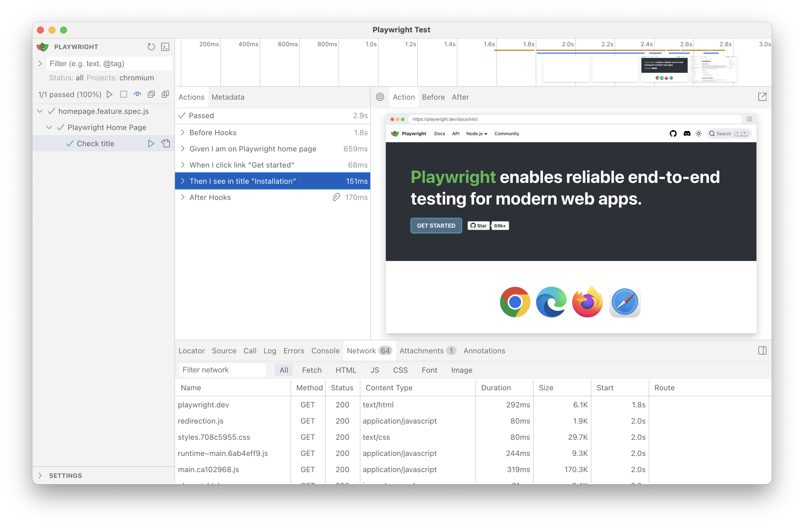

# UI Mode

To debug generated tests in [Playwright UI Mode](https://playwright.dev/docs/test-ui-mode):

1. Enable [watch mode](guides/watch-mode.md) to keep generated tests up to date.
2. In another terminal, start Playwright UI Mode:

```sh
npx playwright test --ui
```


