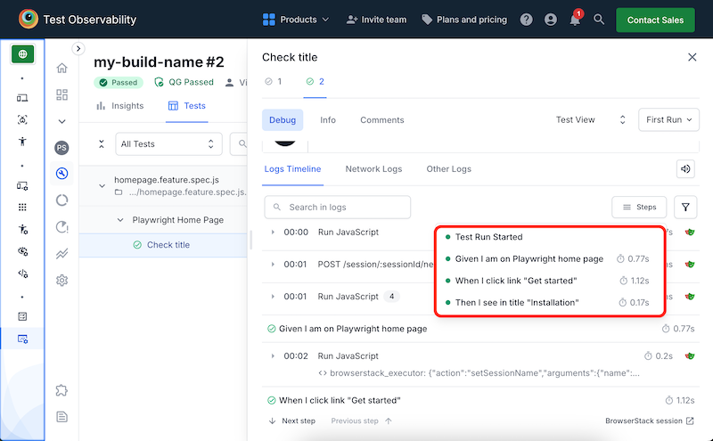

# Usage with BrowserStack

You can run Playwright-BDD tests in the cloud on [BrowserStack](https://www.browserstack.com/) platform.

#### 1. Install `browserstack-node-sdk`
```
npm i -D browserstack-node-sdk
```

#### 2. Setup your BrowserStack credentials
Create `browserstack.yml` file in the project root and add your BrowserStack [username and access key](https://www.browserstack.com/accounts/settings):
```yaml
userName: YOUR_USERNAME
accessKey: YOUR_ACCESS_KEY
```

#### 3. Configure browsers 
Add [configuration](https://www.browserstack.com/docs/automate/playwright/project-config) for build metadata and browsers to run your tests:
```yaml
userName: YOUR_USERNAME
accessKey: YOUR_ACCESS_KEY

projectName: playwright-bdd sample
buildName: my-build-name
buildIdentifier: '#${BUILD_NUMBER}'
platforms:
  - os: Windows
    osVersion: 11
    browserName: chrome
    browserVersion: latest
    playwrightConfigOptions:
      name: chromium
  - os: OS X
    osVersion: Ventura
    browserName: playwright-webkit
    browserVersion: latest
    playwrightConfigOptions:
      name: osx

  # more browsers    
```

#### 4. Run tests

Run tests with the following command:
```
npx bddgen && npx browserstack-node-sdk playwright test
```

Check out the test results in the [BrowserStack dashboard](https://automate.browserstack.com/dashboard):



> Here is the [fully working example with BrowserStack](https://github.com/vitalets/playwright-bdd-example/tree/browserstack).
