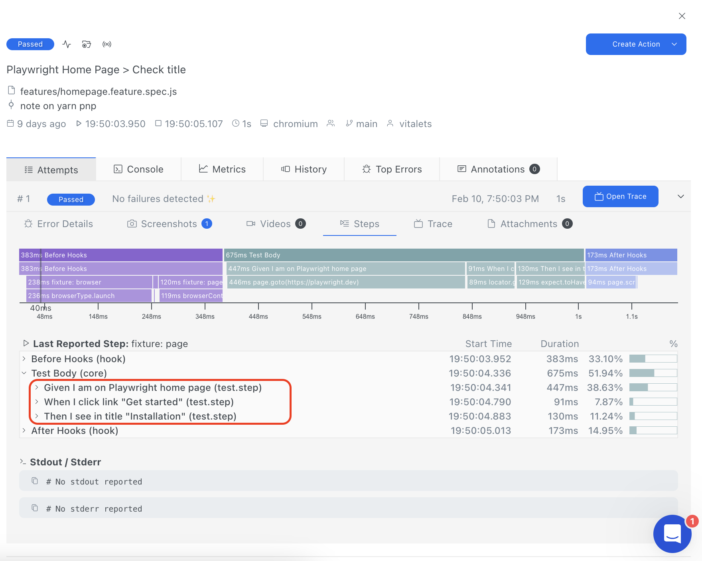

# Usage with Currents

You can integrate Playwright-BDD tests with [Currents](https://currents.dev/) dashboard.

#### 1. [Sign-up](https://app.currents.dev/signup) to Currents and create a new project
Refer to [Playwright setup instruction](https://docs.currents.dev/getting-started/playwright/you-first-playwright-run) in case of any issues.

#### 2. Install dependencies
Run the following command to install Currents + Playwright reporter:
```sh
npm i -D @currents/playwright
```
Install [dotenv](https://www.npmjs.com/package/dotenv) for managing Currents credentials:
```sh
npm i -D dotenv
```

#### 3. Setup credentials
Create the `.env` file with the following variables:
```
CURRENTS_RECORD_KEY=YOUR_RECORD_KEY # the record key from https://app.currents.dev
CURRENTS_PROJECT_ID=YOUR_PROJECT_ID # the projectId from https://app.currents.dev
```

#### 4. Adjust Playwright configuration

In the Playwright config file `playwright.config.ts` setup Currents reporter: 

```ts
import 'dotenv/config';
import { defineConfig, devices } from '@playwright/test';
import { defineBddConfig } from 'playwright-bdd';
import { CurrentsConfig, currentsReporter } from '@currents/playwright';

const currentsConfig: CurrentsConfig = {
  recordKey: process.env.CURRENTS_RECORD_KEY || '',
  projectId: process.env.CURRENTS_PROJECT_ID || '',
};

const testDir = defineBddConfig({
  features: 'features/*.feature',
  steps: 'features/steps/*.ts',
});

export default defineConfig({
  testDir,
  reporter: [currentsReporter(currentsConfig)],
  use: {
    screenshot: 'on',
    trace: 'on',
  },
});
```

#### 5. Run tests
```
npx bddgen && npx playwright test
```

Check out the results in [Currents dashboard](https://app.currents.dev/):



> Here is the [fully working example with Currents](https://github.com/vitalets/playwright-bdd-example/tree/currents).
