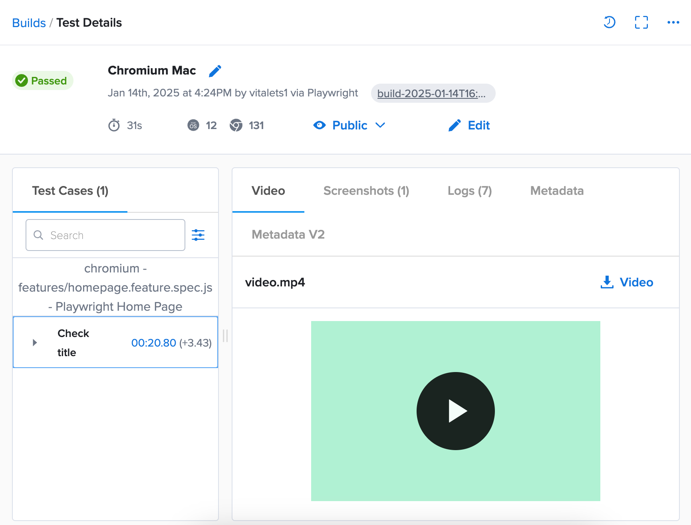

# Usage with SauceLabs

You can run Playwright-BDD tests in the cloud on [SauceLabs](https://saucelabs.com/) platform.

#### 1. Install `saucectl`
```
npm install -g saucectl
```

#### 2. Setup your Sauce Labs credentials
Provide you Sauce Labs [username and access key](https://app.saucelabs.com/user-settings) to the following command:
```
saucectl configure
```

#### 3. Add Sauce Labs configuration
Add Sauce Labs [configuration](https://docs.saucelabs.com/web-apps/automated-testing/playwright/yaml/) in `.sauce/config.yml`:
```yaml
apiVersion: v1alpha
kind: playwright
sauce:
  region: us-west-1
  concurrency: 10
  metadata:
    tags: [e2e, bdd]
playwright:
  version: package.json
npm:
  packages:
    playwright-bdd: latest
rootDir: ./
suites:
  - name: 'Chromium Mac'
    platformName: 'macOS 12'
    screenResolution: '1440x900'
    testMatch: ['.*.js']
    params:
      browserName: 'chromium'
      project: 'chromium' # Runs the project that's defined in `playwright.config.js`
reporters:
  spotlight:
    enabled: true
```

#### 4. Adjust Playwright configuration 

In the Playwright config file `playwright.config.ts` check `process.env.SAUCE_VM` env var and set correct reporter options: 

```ts
import { defineConfig, devices } from '@playwright/test';
import { defineBddConfig } from 'playwright-bdd';

const testDir = defineBddConfig({
  features: 'features/*.feature',
  steps: 'features/steps/*.ts',
});

export default defineConfig({
  testDir,
  reporter: [
    process.env.SAUCE_VM // put report into __assets__ when running on SauceLabs
      ? [ 'html', { open: 'never', outputFolder: '__assets__/html-report/', attachmentsBaseURL: './' } ]
      : [ 'html', { open: 'never' } ],
  ],
  use: {
    screenshot: 'on',
  },
  projects: [
    {
      name: 'chromium', // use project name 'chromium' as defined in '.sauce/config.yml'
      use: { ...devices['Desktop Chrome'] },
    },
  ],
});
```

#### 5. Ignore unnecessary files from Sauce Labs upload
Add `.sauceignore` file with the following paths:
```
# This file instructs saucectl to not package any files mentioned here.

.git/
.github/
.DS_Store
.hg/
.vscode/
.idea/
.gitignore
.hgignore
.gitlab-ci.yml
.npmrc
\*.gif

# Remove this to have node_modules uploaded with code
node_modules/
```

#### 6. Run tests
```
npx bddgen && saucectl run
```

Check out test results in [Sauce Labs dashboard](https://app.saucelabs.com/dashboard/builds/vdc):



> Here is the [fully working example with SauceLabs](https://github.com/vitalets/playwright-bdd-example/tree/saucelabs).

## Limitations

* Check out Sauce Labs [limitations](https://docs.saucelabs.com/web-apps/automated-testing/playwright/limitations/) for Playwright
* BDD steps are not displayed in Sauce Labs reporter, see [sauce-docs#3059](https://github.com/saucelabs/sauce-docs/issues/3059)