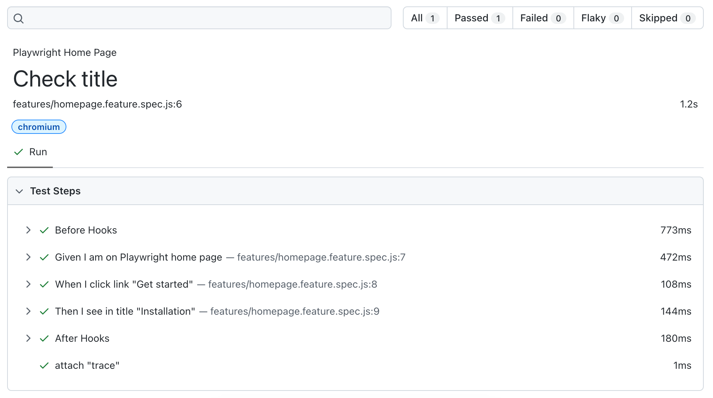

<!-- this file differs from README.md in project root -->

<div align="center">
  <a href="/">
    
  </a>
</div>

<h1 align="center">Playwright-BDD</h1>

<div align="center">

Run [BDD](https://cucumber.io/docs/bdd/) tests with [Playwright](https://playwright.dev/) runner

</div>

## Quick start
Jump to the [getting started](getting-started/index.md) guide or read below the overview of Playwright-BDD project.

<!-- Keep absolute urls to easily update from README.md -->

## Why BDD in the Era of AI?

[BDD](https://cucumber.io/docs/bdd/) scenarios describe behavior through `Given / When / Then` steps, giving AI agents a clear, executable target. These scenarios are easy to read and refine for both humans and agents. They run as tests, so they stay aligned with the codebase over time, unlike plain Markdown specs that tend to drift.

## Why Playwright Runner?

Playwright can be used as a [browser automation library](https://playwright.dev/docs/library) with any test runner, such as CucumberJS or Vitest. But it is most powerful when used with the Playwright test runner. This package converts BDD scenarios into native Playwright tests, so you get all Playwright runner features out of the box:

- Automatic browser setup and cleanup
- Auto-waiting for page elements
- Auto-capture of screenshots, videos, and traces
- Parallel execution and sharding
- Built-in reports and visual comparison testing
- Playwright fixtures
- [...and more](https://playwright.dev/docs/library#key-differences)

<!-- Keep absolute urls to easily update from README.md -->

## Extras
Playwright-BDD extends Playwright with BDD capabilities, offering:

- 🔥 Advanced tagging [by path](https://vitalets.github.io/playwright-bdd/#/writing-features/tags-from-path) and [special tags](https://vitalets.github.io/playwright-bdd/#/writing-features/special-tags)
- 🎩 [Step decorators](https://vitalets.github.io/playwright-bdd/#/writing-steps/decorators) for class methods  
- 🎯 [Scoped step definitions](https://vitalets.github.io/playwright-bdd/#/writing-steps/scoped)  
- ✨ [Exporting steps](https://vitalets.github.io/playwright-bdd/#/writing-features/chatgpt) for AI  
- ♻️ [Re-usable step functions](https://vitalets.github.io/playwright-bdd/#/writing-steps/reusing-step-fn)  

## How Playwright-BDD works
A typical command to run tests with Playwright-BDD is:
```
npx bddgen && npx playwright test
```

### Phase 1: Generate tests
The first command `npx bddgen` generates test files from BDD feature files. For example:

From
```gherkin
Feature: Playwright Home Page

    Scenario: Check title
        Given I am on Playwright home page
        When I click link "Get started"
        Then I see in title "Installation"
```

To
```js
import { test } from 'playwright-bdd';

test.describe('Playwright Home Page', () => {

  test('Check title', async ({ Given, When, Then }) => {
    await Given('I am on Playwright home page');
    await When('I click link "Get started"');
    await Then('I see in title "Installation"');
  });

});
```

### Phase 2: Run tests
The second command `npx playwright test` runs the generated files with the Playwright runner.
Step definitions have access to the Playwright APIs and fixtures (e.g. `page`):

```js
Given('I am on Playwright home page', async ({ page }) => {
  await page.goto('https://playwright.dev');
});

When('I click link {string}', async ({ page }, name) => {
  await page.getByRole('link', { name }).click();
});

Then('I see in title {string}', async ({ page }, text) => {
  await expect(page).toHaveTitle(new RegExp(text));
});  
```

HTML report shows all scenarios and steps:



Proceed to the [installation guide](getting-started/installation.md) and try it yourself.