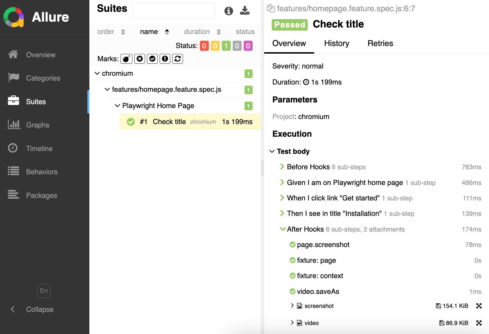

# Allure reporter

You can output test results with [allure-playwright](https://www.npmjs.com/package/allure-playwright) reporter (not `allure-cucumberjs`). Follow the instructions from allure website: [install](https://allurereport.org/docs/install/) allure itself, install allure-playwright and enable it in the config:

```js
import { defineConfig } from '@playwright/test';
import { defineBddConfig } from 'playwright-bdd';

const testDir = defineBddConfig({ /* BDD config */ });

export default defineConfig({
  testDir,
  reporter: 'allure-playwright', // <- enable allure reporter
});
```

Feature file:
```gherkin
Feature: Playwright Home Page

    Scenario: Check title
        Given I am on Playwright home page
        When I click link "Get started"
        Then I see in title "Installation"
```

Allure report:

