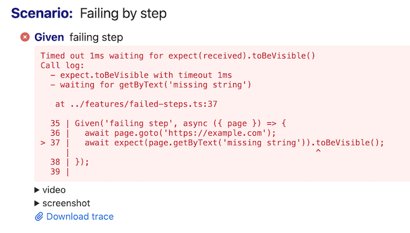
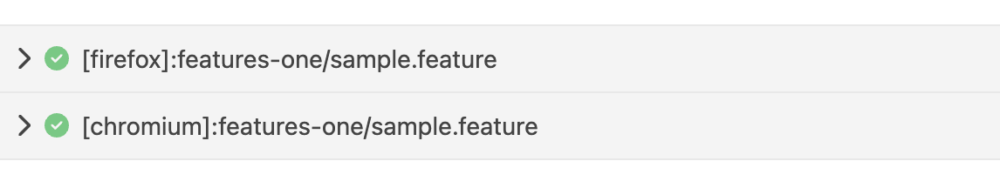
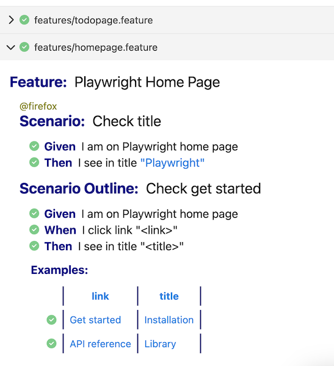

# Cucumber reporters

?> Cucumber reporters is a new feature, feel free to share your feedback in [issues](https://github.com/vitalets/playwright-bdd/issues)

Playwright-bdd provides special adapter to output test results with [Cucumber reporters (formatters)](https://github.com/cucumber/cucumber-js/blob/main/docs/formatters.md).

Currently, the following reporters are supported:

* [html](#html)
* [json](#json)
* [junit](#junit)
* [message](#message)
* [custom](#custom)

Navigate to the concrete reporter for the usage details.

#### Automatic screenshots / videos / traces
Playwright-bdd fully supports [auto attaching screenshots, videos and traces](https://playwright.dev/docs/test-use-options#recording-options) to all Cucumber reports. No special action needed from your side.

<details><summary>Example HTML report with auto-attachments</summary>



</details>

#### Projects

Cucumber formatters don't natively support Playwright's [projects concept](https://playwright.dev/docs/test-projects#introduction). Nevertheless, playwright-bdd adopts Playwright test results and shows all projects in a single Cucumber report.

The final output depends on the particular reporter. For example, in HTML reporter project name is prepended to the feature file path:



<details><summary>Example <code>playwright.config.ts</code> with several projects:</summary>

```ts
import { defineConfig, devices } from '@playwright/test';
import { defineBddConfig, cucumberReporter } from 'playwright-bdd';

const testDir = defineBddConfig({
  features: ['features/*.feature'],
  steps: ['features/steps/*.ts'],
}),

export default defineConfig({
  testDir,
  reporter: [ cucumberReporter('html', { outputFile: 'reports/report.html' }) ],
  projects: [
    {
      name: 'chromium',
      use: { ...devices['Desktop Chrome'] },
    },
    {
      name: 'firefox',
      use: { ...devices['Desktop Firefox'] },
    },
  ],
});
```

</details>

## html

Generates [Cucumber html](https://github.com/cucumber/cucumber-js/blob/main/docs/formatters.md#html) report.

Configure reporter in `playwright.config.js`:
```js
import { defineConfig } from '@playwright/test';
import { defineBddConfig, cucumberReporter } from 'playwright-bdd';

const testDir = defineBddConfig({
  features: ['features/*.feature'],
  steps: ['steps/*.ts'],
});

export default defineConfig({
  testDir,
  reporter: [
    cucumberReporter('html', { outputFile: 'cucumber-report/report.html' }),  
  ],
});
```

<details><summary>Example of <code>report.html</code></summary>



</details>

##### Reporter options

* **outputFile** `string` - path to output html file
* **skipAttachments** `boolean | string[]` (default: `false`) - allows to exclude attachments from report to have smaller file size. Can be boolean or array of content types to skip.
  * Use `image/png` to skip Playwright's screenshots
  * Use `video/webm` to skip Playwright's video recordings
  * Use `application/zip` to skip Playwright's trace files

  ```js
  export default defineConfig({
    reporter: [
        cucumberReporter('html', { 
          outputFile: 'cucumber-report/report.html'
          skipAttachments: [ 'video/webm', 'application/zip' ],
        }),
      ],
    });
  ```

## json
Generates [Cucumber json](https://github.com/cucumber/cucumber-js/blob/main/docs/formatters.md#json) report.

Configure reporter in `playwright.config.js`:
```js
import { defineConfig } from '@playwright/test';
import { defineBddConfig, cucumberReporter } from 'playwright-bdd';

const testDir = defineBddConfig({
  features: ['features/*.feature'],
  steps: ['steps/*.ts'],
});

export default defineConfig({
  testDir,
  reporter: [
    cucumberReporter('json', { outputFile: 'cucumber-report/report.json' }), 
  ],
});
```

<details><summary>Example of <code>report.json</code></summary>

[json report](./_media/json-report.json ':include')

</details>

##### Reporter options

* **outputFile** `string` - path to output json file
* **addProjectToFeatureName** `boolean` - if `true`, project name will be prepended to the feature name, recommended for multi-project run (default: `false`) 
* **addMetadata** `none | list | object` - defines the shape of metadata to attach to feature element. Currently attached properties: `Project`, `Browser`. Useful for third-party reporters. Example of `list` metadata:
    ```json
      {
        "keyword": "Feature",
        "name": "feature one",
        "uri": "features/sample.feature",
        "metadata": [
          { "name": "Project", "value": "my project" },
          { "name": "Browser", "value": "firefox" }
        ]
      },
    ```

* **skipAttachments** `boolean | string[]` (default: `false`) - see [skipAttachments](#reporter-options) in HTML report

Output of json reporter can be used to generate some third-party reports.
Take a look on two these projects:

* [WasiqB/multiple-cucumber-html-reporter](https://github.com/WasiqB/multiple-cucumber-html-reporter)
* [gkushang/cucumber-html-reporter](https://github.com/gkushang/cucumber-html-reporter)

## junit
Generates [Cucumber junit](https://github.com/cucumber/cucumber-js/blob/main/docs/formatters.md#junit) report.

Configure reporter in `playwright.config.js`:
```js
import { defineConfig } from '@playwright/test';
import { defineBddConfig, cucumberReporter } from 'playwright-bdd';

const testDir = defineBddConfig({
  features: ['features/*.feature'],
  steps: ['steps/*.ts'],
});

export default defineConfig({
  testDir,
  reporter: [
    cucumberReporter('junit', { 
      outputFile: 'cucumber-report/report.xml',
      suiteName: 'my suite'
    }), 
  ],
});
```

<details><summary>Example of <code>report.xml</code></summary>

[junit report](./_media/junit-report.xml ':include')

</details>

##### Reporter options

* **outputFile** `string` - path to output xml file
* **suiteName** `string` - name attribute of the `testsuite` element 

> Junit reporter does not contain attachments

## message
Generates [Cucumber message](https://github.com/cucumber/cucumber-js/blob/main/docs/formatters.md#message) report.

Configure reporter in `playwright.config.js`:
```js
import { defineConfig } from '@playwright/test';
import { defineBddConfig, cucumberReporter } from 'playwright-bdd';

const testDir = defineBddConfig({
  features: ['features/*.feature'],
  steps: ['steps/*.ts'],
});

export default defineConfig({
  testDir,
  reporter: [
    cucumberReporter('message', { outputFile: 'cucumber-report/report.ndjson' }), 
  ],
});
```

<details><summary>Example of <code>report.ndjson</code></summary>

[message report](./_media/message-report.ndjson ':include')

</details>

##### Reporter options

* **outputFile** `string` - path to output ndjson file
* **skipAttachments** `boolean | string[]` (default: `false`) - see [skipAttachments](#reporter-options) in HTML report

> Please note that these 4 [message types](https://github.com/cucumber/messages/blob/main/messages.md#envelope) are not supported yet:
> - `parameterType`
> - `stepDefinition`
> - `undefinedParameterType`
> - `parseError`
>
> If they are required for your report feel free to [open an issue](https://github.com/vitalets/playwright-bdd/issues). 

## custom
Playwright-bdd supports [custom Cucumber formatters](https://github.com/cucumber/cucumber-js/blob/main/docs/custom_formatters.md). 

Create custom reporter file, e.g. `my-reporter.ts`:
```ts
import * as messages from '@cucumber/messages';
import { Formatter, IFormatterOptions } from '@cucumber/cucumber';

export default class CustomFormatter extends Formatter {
  constructor(options: IFormatterOptions) {
    super(options);
    options.eventBroadcaster.on('envelope', (envelope: messages.Envelope) => {
      console.log(JSON.stringify(envelope));
    });
  }
}
```

!> Please note that constructor options `colorFns`, `snippetBuilder` and `supportCodeLibrary` are passed as fake objects

Configure reporter in `playwright.config.js`:
```js
import { defineConfig } from '@playwright/test';
import { defineBddConfig, cucumberReporter } from 'playwright-bdd';

const testDir = defineBddConfig({
  features: 'features/*.feature',
  steps: 'steps/*.ts',
});

export default defineConfig({
  testDir,
  reporter: [
    cucumberReporter('./my-reporter.ts', { someKey: 'someValue' }), 
  ],
});
```

All options passed to `cucumberReporter()` will be available as `options.parsedArgvOptions`.

## Merge reports

Since Playwright **1.37** there is a [merge-reports](https://playwright.dev/docs/test-sharding#merging-reports-from-multiple-shards) command that outputs combined report from several shards. Playwright-bdd supports this feature as well and can produce combined Cucumber reports.

Add configuration to `playwright.config.ts`:
```ts
import { defineConfig } from '@playwright/test';
import { defineBddConfig, cucumberReporter } from 'playwright-bdd';

const testDir = defineBddConfig({
  features: ['features/*.feature'],
  steps: ['features/*.ts'],
  // Set to true to enrich data in Blob report
  enrichReporterData: true,
});

// Distinguish shard runs from regular local runs and merge-reports run
const isShardRun = process.argv.some((a) => a.startsWith('--shard'));

export default defineConfig({
  testDir,
  reporter: isShardRun
    ? 'blob' // on shard output Blob report
    : [ cucumberReporter('html', { outputFile: 'report.html' }) ],
});
```

Run tests on shard:
```
npx bddgen && npx playwright test --shard 1/2
npx bddgen && npx playwright test --shard 2/2
```

Merge reports (important to pass`--config` option pointing to `playwright.config.ts`):
```
npx playwright merge-reports --config playwright.config.ts ./blob-report
```