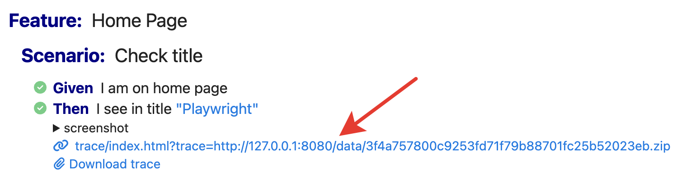

# Cucumber Reporters

Playwright-BDD provides a special adapter to output test results with [Cucumber reporters (formatters)](https://github.com/cucumber/cucumber-js/blob/main/docs/formatters.md).

Currently, the following reporters are supported:

* [html](#html)
* [json](#json)
* [junit](#junit)
* [message](#message)
* [custom](#custom)

#### Automatic screenshots / videos / traces
Playwright-BDD fully supports auto-attaching of **screenshots**, **videos**, and **traces** to all Cucumber reports. Enable these options in the [Playwright config](https://playwright.dev/docs/test-use-options#recording-options).

<details><summary>Example of HTML report with attached screenshot, video, and trace</summary>


</details>

#### Projects

Cucumber formatters don't natively support the [projects concept](https://playwright.dev/docs/test-projects#introduction) in Playwright. However, Playwright-BDD adapts test results to show projects in a Cucumber report.

The final output depends on the particular reporter. For example, in the HTML reporter, the project name is prepended to the feature file path:


<details><summary>Example <code>playwright.config.ts</code> with several projects:</summary>

```ts
import { defineConfig, devices } from '@playwright/test';
import { defineBddConfig, cucumberReporter } from 'playwright-bdd';

const testDir = defineBddConfig({
  features: 'features/*.feature',
  steps: 'features/steps/*.ts',
});

export default defineConfig({
  testDir,
  reporter: [ 
    cucumberReporter('html', { outputFile: 'cucumber-report/index.html' })
  ],
  projects: [
    {
      name: 'chromium',
      use: { ...devices['Desktop Chrome'] },
    },
    {
      name: 'firefox',
      use: { ...devices['Desktop Firefox'] },
    },
  ],
});
```

</details>

## html

Generates [Cucumber html](https://github.com/cucumber/cucumber-js/blob/main/docs/formatters.md#html) report.

Configure reporter in `playwright.config.js`:
```js
import { defineConfig } from '@playwright/test';
import { defineBddConfig, cucumberReporter } from 'playwright-bdd';

const testDir = defineBddConfig({
  features: 'features/*.feature',
  steps: 'steps/*.ts',
});

export default defineConfig({
  testDir,
  reporter: [
    cucumberReporter('html', { outputFile: 'cucumber-report/index.html' }),  
  ],
});
```

<details><summary>Example of <code>report.html</code></summary>


</details>

##### Reporter options

* **outputFile** `string` - Path to output HTML file.
* **skipAttachments** `boolean | string[]` (default: `false`) - Exclude attachments from the report to reduce file size. Can be boolean or an array of content types to skip.
  * Use `image/png` to skip Playwright's screenshots.
  * Use `video/webm` to skip Playwright's video recordings.
  * Use `application/zip` to skip Playwright's trace files.

  ```js
  export default defineConfig({
    reporter: [
        cucumberReporter('html', { 
          outputFile: 'cucumber-report/index.html',
          skipAttachments: [ 'video/webm', 'application/zip' ],
        }),
      ],
    });
  ```
* **externalAttachments** `boolean` - Store attachments as separate files in the `data` directory next to the report file. This can significantly reduce report size.
* **attachmentsBaseURL** `string` - A separate location where attachments from the `data` subdirectory are uploaded. Only needed when you upload the report and data separately to different locations. The same as `attachmentsBaseURL` of Playwright's [HTML reporter](https://playwright.dev/docs/test-reporters#html-reporter).

#### Trace viewer
When you set `externalAttachments: true`, the Cucumber HTML report embeds the Playwright [trace viewer](https://playwright.dev/docs/trace-viewer):

```js
export default defineConfig({
  reporter: [
    cucumberReporter('html', { 
      outputFile: 'cucumber-report/index.html',
      externalAttachments: true,
    }),
  ],
});
```

To view the trace by click, you should open the HTML report on the `http(s)://` schema, not on `file://`. To achieve that on a local machine, you can start an HTTP server with the following command:
```
npx http-server ./cucumber-report -c-1 -a localhost -o index.html
```



You can add that command to `package.json` scripts to open the Cucumber report quickly:
```json
{
  "scripts": {
    "report": "npx http-server ./cucumber-report -c-1 -a localhost -o index.html"
  }
}
```
Open the Cucumber report:
```
npm run report
```

## json
Generates [Cucumber json](https://github.com/cucumber/cucumber-js/blob/main/docs/formatters.md#json) report.

Configure reporter in `playwright.config.js`:
```js
import { defineConfig } from '@playwright/test';
import { defineBddConfig, cucumberReporter } from 'playwright-bdd';

const testDir = defineBddConfig({
  features: ['features/*.feature'],
  steps: ['steps/*.ts'],
});

export default defineConfig({
  testDir,
  reporter: [
    cucumberReporter('json', { outputFile: 'cucumber-report/report.json' }), 
  ],
});
```

<details><summary>Example of <code>report.json</code></summary>

[json report](./_media/json-report.json ':include')

</details>

##### Reporter options

* **outputFile** `string` - Path to output JSON file.
* **addProjectToFeatureName** `boolean` - If `true`, the project name will be prepended to the feature name, recommended for multi-project runs (default: `false`).
* **addMetadata** `none | list | object` - Defines the shape of metadata to attach to the feature element. Currently attached properties: `Project`, `Browser`. Useful for third-party reporters. Example of `list` metadata:
    ```json
      {
        "keyword": "Feature",
        "name": "feature one",
        "uri": "features/sample.feature",
        "metadata": [
          { "name": "Project", "value": "my project" },
          { "name": "Browser", "value": "firefox" }
        ]
      },
    ```

* **skipAttachments** `boolean | string[]` (default: `false`) - See [skipAttachments](#reporter-options) in the HTML report.

Output of the JSON reporter can be used to generate some third-party reports. Take a look at these projects:

* [WasiqB/multiple-cucumber-html-reporter](https://github.com/WasiqB/multiple-cucumber-html-reporter)
* [gkushang/cucumber-html-reporter](https://github.com/gkushang/cucumber-html-reporter)

## junit
Generates [Cucumber junit](https://github.com/cucumber/cucumber-js/blob/main/docs/formatters.md#junit) report.

Configure reporter in `playwright.config.js`:
```js
import { defineConfig } from '@playwright/test';
import { defineBddConfig, cucumberReporter } from 'playwright-bdd';

const testDir = defineBddConfig({
  features: ['features/*.feature'],
  steps: ['steps/*.ts'],
});

export default defineConfig({
  testDir,
  reporter: [
    cucumberReporter('junit', { 
      outputFile: 'cucumber-report/report.xml',
      suiteName: 'my suite'
    }), 
  ],
});
```

<details><summary>Example of <code>report.xml</code></summary>

[junit report](./_media/junit-report.xml ':include')

</details>

##### Reporter options

* **outputFile** `string` - Path to output XML file.
* **suiteName** `string` - Name attribute of the `testsuite` element.

> Junit reporter does not contain attachments.

## message
Generates [Cucumber message](https://github.com/cucumber/cucumber-js/blob/main/docs/formatters.md#message) report.

Configure reporter in `playwright.config.js`:
```js
import { defineConfig } from '@playwright/test';
import { defineBddConfig, cucumberReporter } from 'playwright-bdd';

const testDir = defineBddConfig({
  features: ['features/*.feature'],
  steps: ['steps/*.ts'],
});

export default defineConfig({
  testDir,
  reporter: [
    cucumberReporter('message', { outputFile: 'cucumber-report/report.ndjson' }), 
  ],
});
```

<details><summary>Example of <code>report.ndjson</code></summary>

[message report](./_media/message-report.ndjson ':include')

</details>

##### Reporter options

* **outputFile** `string` - Path to output NDJSON file.
* **skipAttachments** `boolean | string[]` (default: `false`) - See [skipAttachments](#reporter-options) in the HTML report.

> Please note that these 4 [message types](https://github.com/cucumber/messages/blob/main/messages.md#envelope) are not supported yet:
> - `parameterType`
> - `stepDefinition`
> - `undefinedParameterType`
> - `parseError`
>
> If they are required for your report, feel free to [open an issue](https://github.com/vitalets/playwright-bdd/issues). 

## custom
Playwright-BDD supports [custom Cucumber formatters](https://github.com/cucumber/cucumber-js/blob/main/docs/custom_formatters.md). 

Create custom reporter file, e.g., `my-reporter.ts`:
```ts
import * as messages from '@cucumber/messages';
import { Formatter, IFormatterOptions } from '@cucumber/cucumber';

export default class CustomFormatter extends Formatter {
  constructor(options: IFormatterOptions) {
    super(options);
    options.eventBroadcaster.on('envelope', (envelope: messages.Envelope) => {
      console.log(JSON.stringify(envelope));
    });
  }
}
```

!> Please note that constructor options `colorFns`, `snippetBuilder`, and `supportCodeLibrary` are passed as fake objects.

Configure reporter in `playwright.config.js`:
```js
import { defineConfig } from '@playwright/test';
import { defineBddConfig, cucumberReporter } from 'playwright-bdd';

const testDir = defineBddConfig({
  features: 'features/*.feature',
  steps: 'steps/*.ts',
});

export default defineConfig({
  testDir,
  reporter: [
    cucumberReporter('./my-reporter.ts', { someKey: 'someValue' }), 
  ],
});
```

All options passed to `cucumberReporter()` will be available as `options.parsedArgvOptions`.

## Merge reports

Since Playwright **1.37**, there is a [merge-reports](https://playwright.dev/docs/test-sharding#merging-reports-from-multiple-shards) command that outputs a combined report from several shards. Playwright-BDD supports this feature as well and can produce combined Cucumber reports.

Add configuration to `playwright.config.ts`:
```ts
import { defineConfig } from '@playwright/test';
import { defineBddConfig, cucumberReporter } from 'playwright-bdd';

const testDir = defineBddConfig({
  features: 'features/*.feature',
  steps: 'features/*.ts',
});

// Distinguish shard runs from regular local runs and merge-reports run
const isShardRun = process.argv.some((a) => a.startsWith('--shard'));

export default defineConfig({
  testDir,
  reporter: isShardRun
    ? 'blob' // on shard output Blob report
    : [ cucumberReporter('html', { outputFile: 'report.html' }) ],
});
```

Run tests on shard:
```
npx bddgen && npx playwright test --shard 1/2
npx bddgen && npx playwright test --shard 2/2
```

Merge reports (important to pass the `--config` option pointing to `playwright.config.ts`):
```
npx playwright merge-reports --config playwright.config.ts ./blob-report
```