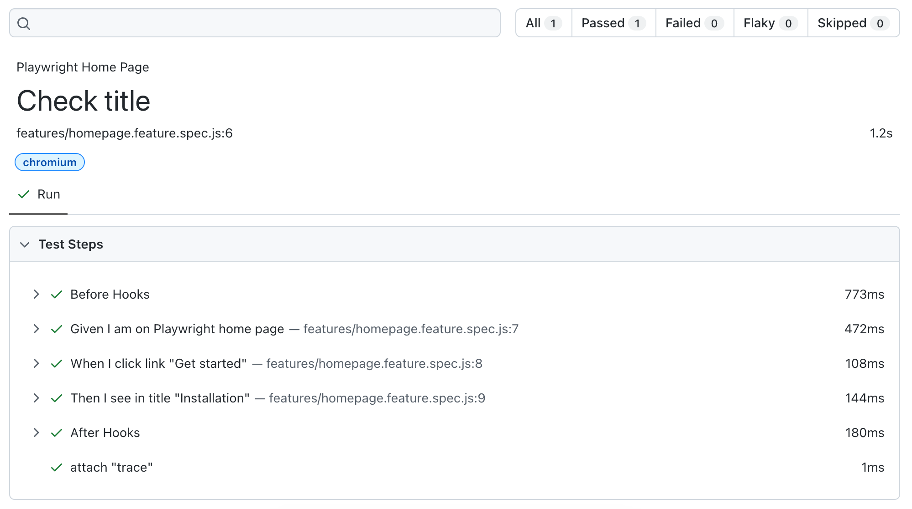

# Playwright Reporters

All [Playwright reporters](https://playwright.dev/docs/test-reporters) are supported out-of-box. They are less BDD-adopted but contain all the latest features of Playwright reporting.

Example of enabling Playwright HTML reporter:
```js
import { defineConfig } from '@playwright/test';
import { defineBddConfig } from 'playwright-bdd';

const testDir = defineBddConfig({ /* BDD config */ });

export default defineConfig({
  testDir,
  reporter: 'html', // <- define reporter as usual
});
```

Feature file:
```gherkin
Feature: Playwright Home Page

    Scenario: Check title
        Given I am on Playwright home page
        When I click link "Get started"
        Then I see in title "Installation"
```

Report:


If you need more BDD-adopted reports, have a look at [Cucumber reporters](reporters/cucumber.md).

