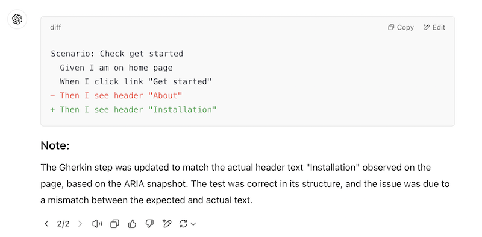

# Исправление с помощью AI

> Это **экспериментальная** функция, не стесняйтесь делиться вашими отзывами в [issues](https://github.com/vitalets/playwright-bdd/issues).

Playwright-BDD **v8.1.0** представил новую функцию под названием **Fix with AI**. Она помогает быстро исправлять падающие тесты с помощью предложений AI.

Когда тест падает, Playwright-BDD предварительно генерирует AI промпт и прикрепляет его к отчету.
Вы можете скопировать этот промпт в ваш любимый AI чат и получить предложения о том, как исправить тест.

Промпт содержит релевантный контекст теста:

- сообщение об ошибке
- шаги сценария
- фрагмент кода теста
- [ARIA снимок](https://playwright.dev/docs/aria-snapshots) страницы

Пример прикрепленного промпта:


<details>
  <summary>Шаблон промпта:</summary>

```
You are an expert in Playwright BDD testing.
Fix the error in the BDD scenario.

- Provide response as a diff highlighted code snippet.
- First, try to fix the test by adjusting Gherkin steps parameters.
- If the test is not fixable by Gherkin, try to modify the code snippet.
- Strictly rely on the ARIA snapshot of the page.
- Avoid adding any new code.
- Avoid adding comments to the code.
- Avoid changing the test logic.
- Use only role-based locators: getByRole, getByLabel, etc.
- Add a concise note about applied changes.
- If the test may be correct and there is a bug in the page, note it.

Failing gherkin scenario:

Scenario: {scenarioName}
{steps}

Error details:
{error}

{snippet}

ARIA snapshot of the page:

{ariaSnapshot}
```

</details>

## Как включить

1. Убедитесь, что у вас **Playwright v1.49** или новее. Функция Fix with AI требует доступности [ARIA-снимков](https://playwright.dev/docs/release-notes#aria-snapshots).

2. Убедитесь, что у вас **Playwright-BDD v8.1.0** или новее

3. Добавьте секцию `aiFix` в BDD конфиг:
    ```js
    const testDir = defineBddConfig({
      aiFix: {
        promptAttachment: true,
      },
      // ...other options
    });
    ```

Вот и все. Теперь вы можете запустить падающий тест и проверить HTML отчеты.

### Playwright HTML отчет

В Playwright HTML отчете вы можете развернуть вложение и скопировать промпт, нажав на маленькую кнопку в правом верхнем углу:


### Cucumber HTML отчет

В Cucumber HTML отчете есть дополнительные элементы управления, которые помогают скопировать промпт в буфер обмена и открыть ChatGPT:


## Пример ответа (ChatGPT)

Вот пример ответа от ChatGPT, который исправляет тест:



## Настройка промпта

Вы можете настроить шаблон промпта, чтобы получить лучшие результаты для вашего проекта:

```js
const testDir = defineBddConfig({
  aiFix: {
    promptAttachment: true,
    promptTemplate: 'my custom prompt'
  },
  // ...other options
});
```

Ознакомьтесь с [промптом по умолчанию](https://github.com/vitalets/playwright-bdd/blob/main/src/ai/promptTemplate.ts) для вдохновения и списка доступных плейсхолдеров:

- `{scenarioName}`
- `{steps}`
- `{error}`
- `{snippet}`
- `{ariaSnapshot}`

?> Если вы получили отличные результаты с вашим пользовательским промптом, мы приглашаем вас поделиться им с сообществом!

## Использование не-дефолтной страницы

По умолчанию AI промпт захватывает ARIA снимок из встроенного экземпляра `page` Playwright.
Если вы используете сценарии с несколькими страницами, вы можете вручную установить экземпляр `page` для захвата ARIA снимка.
Для этого используйте BDD фикстуру `$prompt`:

```js
When('I open a new tab', async ({ page, context, $prompt }) => { // <-- добавить фикстуру $prompt
  const [newPage] = await Promise.all([
    context.waitForEvent('page'),
    page.getByRole('link').click(),
  ]);
  $prompt.setPage(newPage); // <-- вызвать $prompt.setPage() для переключения страницы
  await expect(newPage.getByRole('heading')).toContainText('Another page');
});
```

## Ограничения

В некоторых случаях промпт не генерируется:

- ошибка произошла в хуках, до инициализации фикстуры `page`
- ваши тесты не используют фикстуру `page` (например, API тестирование)

Если вы ожидаете, что промпт будет прикреплен, но его нет, попробуйте воспроизвести ваш случай на [ветке "ai" playwright-bdd-example](https://github.com/vitalets/playwright-bdd-example/tree/ai) и откройте [issue](https://github.com/vitalets/playwright-bdd/issues).
